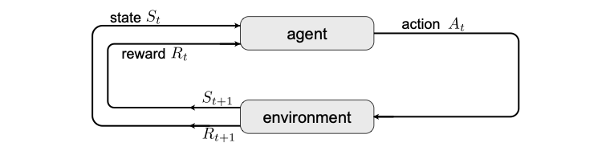

### Markov Chains, MRPs, MDPs
- **Markov Chain**:
A model containing states and transitions between states. Each transition has a probability which depends only on current state and is independent of the past history.
- **Markov Reward Process**:
It is a Markov chain with rewards for arriving at each state. The accumulated reward is also stored.
- **Markov Decision Process**:
It is like an MRP which allows the agent to take an action from a state. Transition probabilities depend on the action.

### Markov Decision Process in Detail
- Reinforcement learning problems can be modelled using Markov Decision Processes or MDPs.

- MDPs are a 5-tuple $(S, A, P_a, R_a, \gamma)$
  - $S$: set of all states
  - $A$: set of all actions
  - $P_a(s,s')$: probabilty of state transition from s to s' after action a
  - $R_a(s,s')$: reward for an action a, obtained during transition from s to s'
  - $\gamma$: discount factor
- *State* is the information regarding the environment that the agent has.   
e.g. location, velocity
- *Actions* are undertaken by the agent to interact with the environment  
e.g. walking in a direction or shooting a laser
- *Transitions* occur at every *timestep*. The next state is based on the actions.  
e.g. moving to adjacent cell
- *Rewards* are given to the agent based on the action taken. These maybe positive or negative.   
e.g. positive reward for winning, negative reward for getting damage

- The Markov Property is an important property of MDPs. It implies that the next state depends on only the current state and not on the previous states.
$ P(S_n=s_n | S_{n-1}=s_{n-1}, \dots, S_0=s_0) = P(S_n=s_n | S_{n-1}=s_{n-1})$

- After defining a problem in this way, we try to find the best policy $\pi$ which results in maximum sum of rewards.

- A common method is to estimate the value of each state or state-action pair in terms of the expected reward.

Note: The set of states and actions can be infinite. MDPs have discrete values for states and actions but many problems have continuous domain of values.  Either they have to be discretized or another method such as policy gradients has to be used.
